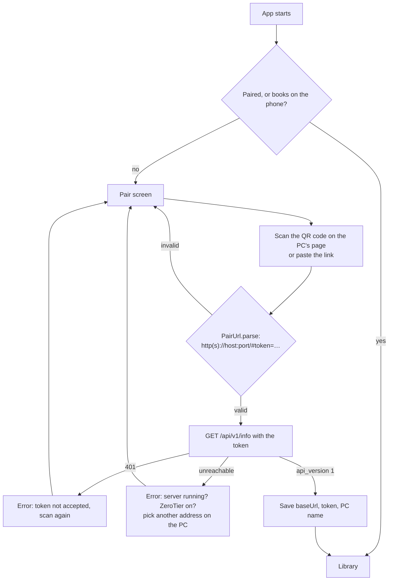
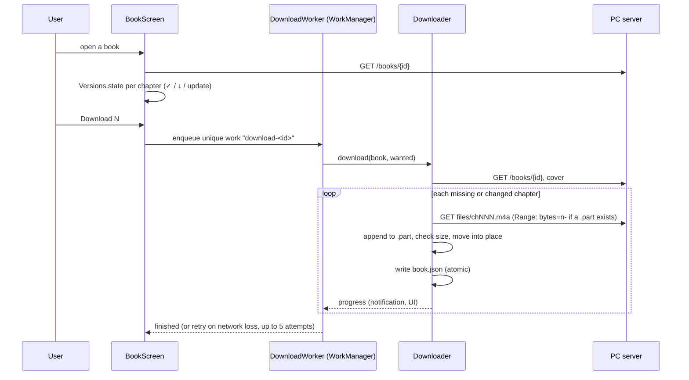
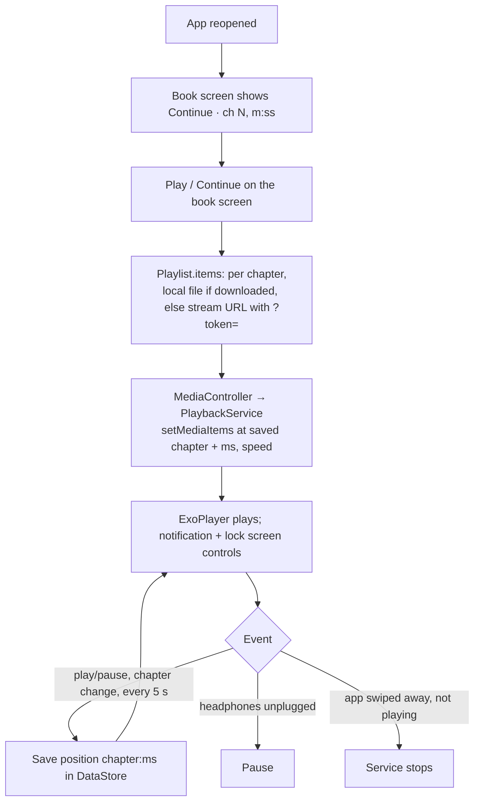

# Android component: workflows

## Start and pairing

```mermaid
flowchart TD
  A[App starts] --> B{Paired, or books on the phone?}
  B -- no --> P[Pair screen]
  B -- yes --> L[Library]
  P --> S[Scan the QR code on the PC's page<br/>or paste the link]
  S --> Q{"PairUrl.parse:<br/>http(s)://host:port/#token=…"}
  Q -- invalid --> P
  Q -- valid --> I[GET /api/v1/info with the token]
  I -- 401 --> E1[Error: token not accepted, scan again] --> P
  I -- unreachable --> E2[Error: server running? ZeroTier on?<br/>pick another address on the PC] --> P
  I -- api_version 1 --> V[Save baseUrl, token, PC name] --> L
```

## Library and download

```mermaid
sequenceDiagram
  participant U as User
  participant B as BookScreen
  participant W as DownloadWorker (WorkManager)
  participant D as Downloader
  participant PC as PC server
  U->>B: open a book
  B->>PC: GET /books/{id}
  B->>B: Versions.state per chapter (✓ / ↓ / update)
  U->>B: Download N
  B->>W: enqueue unique work "download-<id>"
  W->>D: download(book, wanted)
  D->>PC: GET /books/{id}, cover
  loop each missing or changed chapter
    D->>PC: GET files/chNNN.m4a (Range: bytes=n- if a .part exists)
    D->>D: append to .part, check size, move into place
    D->>D: write book.json (atomic)
    D-->>W: progress (notification, UI)
  end
  W-->>B: finished (or retry on network loss, up to 5 attempts)
```

## Playback and resume

```mermaid
flowchart TD
  A[Play / Continue on the book screen] --> B[Playlist.items: per chapter,<br/>local file if downloaded, else stream URL with ?token=]
  B --> C[MediaController → PlaybackService<br/>setMediaItems at saved chapter + ms, speed]
  C --> D["ExoPlayer plays; notification + lock screen controls"]
  D --> E{Event}
  E -- play/pause, chapter change, every 5 s --> F[Save position chapter:ms in DataStore]
  E -- headphones unplugged --> G[Pause]
  E -- app swiped away, not playing --> H[Service stops]
  F --> D
  I[App reopened] --> J[Book screen shows Continue · ch N, m:ss] --> A
```
